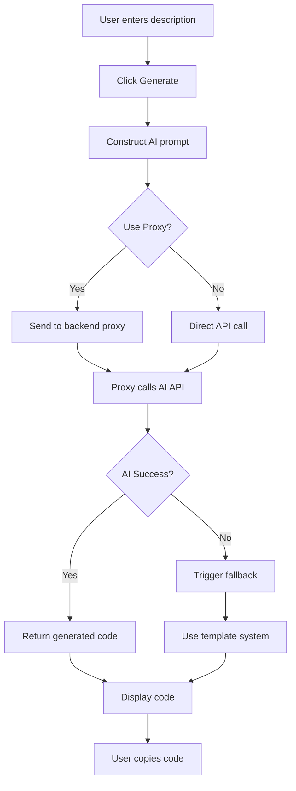

# Website Design Plan for Luau LocalPlayer Script Generator

## Overview
This website allows users to generate Luau code for Roblox LocalPlayer scripts by providing a description or prompt. The design focuses on simplicity, user-friendliness, and ease of code generation. It features AI integration with OpenAI GPT-4 for dynamic code generation, with fallback to keyword-based templates on failure.

## File Structure
- `index.html`: Main HTML file containing the structure of the webpage, including the input form and output display.
- `styles.css`: CSS file for styling the interface, ensuring a clean and responsive design.
- `script.js`: JavaScript file handling user interactions, code generation logic, and output display.
- `README.md`: Updated project documentation.

## Key Components
- **Input Section**: A textarea for users to enter their script description (e.g., "Create a script to make the player fly").
- **Generate Button**: Triggers the code generation process.
- **Output Section**: Displays the generated Luau code in a formatted code block.
- **Copy Button**: Allows users to copy the generated code to clipboard.
- **Header**: Simple title and description of the tool.

## HTML Structure
```html
<!DOCTYPE html>
<html lang="en">
<head>
    <meta charset="UTF-8">
    <meta name="viewport" content="width=device-width, initial-scale=1.0">
    <title>Luau Script Generator</title>
    <link rel="stylesheet" href="styles.css">
</head>
<body>
    <header>
        <h1>Luau LocalPlayer Script Generator</h1>
        <p>Enter a description to generate Luau code for Roblox scripts.</p>
    </header>
    <main>
        <form id="script-form">
            <label for="prompt">Script Description:</label>
            <textarea id="prompt" placeholder="e.g., Make the player invincible"></textarea>
            <button type="submit">Generate Code</button>
        </form>
        <section id="output">
            <h2>Generated Code</h2>
            <pre><code id="code-output"></code></pre>
            <button id="copy-btn">Copy Code</button>
        </section>
    </main>
    <script src="script.js"></script>
</body>
</html>
```

## CSS Styling
- **Layout**: Use flexbox for centering and responsive design.
- **Colors**: Dark background (#1e1e1e) with light text for a code editor feel.
- **Typography**: Monospace font for code output.
- **Responsiveness**: Media queries for mobile devices.
- **Styling Details**:
  - Body: Full height, centered content.
  - Form: Padded inputs, styled button.
  - Output: Scrollable code block, hidden initially, shown after generation.

## JavaScript Functionality
- **Event Handling**: Listen for form submission to prevent default and trigger generation.
- **Code Generation**: A function that takes the prompt and generates code.
- **Output Display**: Update the code element with generated code and show the output section.
- **Copy Functionality**: Use navigator.clipboard to copy code to clipboard.
- **Error Handling**: Basic validation for empty prompts.

## Code Generation Logic
### AI-Powered Generation (Primary)
- Use OpenAI GPT-4 API for dynamic code generation based on user prompts.
- Prompt engineering includes exploiter-like functions (CFrame, getfenv, pcall) for advanced functionality.
- Async handling with loading states to provide user feedback during generation.
- Client-side API setup with placeholder key for development; recommend backend proxy for production.

### Template Fallback
- On AI failure (network error, rate limit, etc.), fall back to keyword-based template system.
- Define a set of templates for common script types (e.g., fly, teleport, speed).
- Parse the prompt for keywords using simple string matching or regex.
- Combine matching templates into a complete script.
- Example:
  - If prompt contains "fly", include fly script snippet.
  - Wrap in LocalPlayer context.

## Workflow Diagram


## AI Integration Implementation

### Overview
Replace the keyword-based template system with AI-powered code generation using a large language model. This enables generation of Luau code for ANY user-described functionality, not limited to predefined keywords. The AI will create flexible, advanced scripts based on natural language descriptions, incorporating exploiter-like functions such as CFrame, getfenv, and pcall as appropriate.

### Architecture
The application uses client-side architecture with API calls to OpenAI GPT-4. Currently implemented with placeholder API key; backend proxy recommended for production security.

#### Components
- **Frontend (Client-side)**: HTML, CSS, JS - Handles UI, user input, and displays generated code.
- **AI API**: External service for code generation.
- **Backend Proxy (Optional but Recommended)**: Serverless function to proxy API calls, keeping API keys secure.

#### Data Flow
1. User enters description in textarea.
2. On generate button click, JS constructs prompt and sends to AI API (via proxy if used).
3. AI generates Luau code based on prompt.
4. Code is returned and displayed in the output section.
5. Fallback to template system if AI fails.

### API Choice
- **Primary Provider**: OpenAI GPT-4 (via Chat Completions API)
  - Reasons: Excellent code generation capabilities, supports Luau/Roblox scripting context, CORS-enabled for client-side calls.
  - Considerations: Rate limits ($0.03/1K tokens), cost per request, requires API key.
- **Alternative Providers**:
  - Anthropic Claude: Similar capabilities, potentially better safety.
  - Hugging Face Inference API: Free tier available, but may have limitations for complex code.
- **Implementation**: Use fetch() API for HTTP requests. For production, implement backend proxy using Vercel Functions or similar.

### Security Considerations
- **API Key Exposure**: Client-side calls expose API keys in browser code. Mitigation: Use backend proxy to handle API calls server-side.
- **User Input Sanitization**: Validate and sanitize user prompts to prevent prompt injection attacks.
- **Rate Limiting**: Implement client-side rate limiting to prevent abuse.
- **Error Handling**: Do not expose internal errors; provide user-friendly messages.
- **Data Privacy**: No user data stored; prompts sent to AI provider per their privacy policies.

### Prompt Engineering
Craft prompts to ensure accurate, safe Luau code generation with specific function inclusion.

#### System Prompt
```
You are an expert Roblox Luau script developer. Generate functional, safe Luau code for LocalPlayer scripts based on user descriptions. Always include proper error handling and follow Roblox best practices. Use exploiter-like functions such as CFrame, getfenv, pcall when appropriate for advanced functionality.
```

#### User Prompt Template
```
Generate a Roblox Luau LocalPlayer script that: {user_description}

Requirements:
- Use proper Luau syntax
- Include LocalPlayer context
- Incorporate functions like CFrame for transformations, getfenv for environment access, pcall for error handling where relevant
- Ensure the code is executable and safe
- Add comments for clarity

Output only the Luau code, no explanations.
```

#### Example Prompt
User input: "Make the player fly and teleport randomly"
Generated prompt: "Generate a Roblox Luau LocalPlayer script that: Make the player fly and teleport randomly ..."

### Fallback Handling
- **Primary Fallback**: If AI API call fails (network error, rate limit, invalid response), fall back to the existing keyword-based template system.
- **Secondary Fallback**: If no templates match, display a message suggesting refinement of the description.
- **Error Scenarios**:
  - Network failure: Show "Unable to generate code. Using basic templates." and proceed with templates.
  - API error: Parse error response and handle accordingly (e.g., quota exceeded).
  - Invalid code: Validate generated code for basic syntax; if invalid, fall back.

### Workflow Diagram


### Implementation Considerations
- **Async Handling**: Implemented with async/await for API calls to avoid blocking UI.
- **Loading States**: Implemented with "Generating..." message during API call.
- **Code Validation**: Basic checks for Luau syntax (e.g., presence of 'local', 'end').
- **Caching**: Optionally cache successful generations for similar prompts (client-side localStorage).
- **Testing**: Unit tests for prompt construction, API response parsing, fallback logic.

## Next Steps
- HTML, CSS, and JS implemented as per this plan.
- Test the AI generation and template fallback with various prompts.
- Add syntax highlighting (e.g., using Prism.js) for better code display.
- Ensure the site is hosted on GitHub Pages.
- AI integration implemented with fallback to templates.
- Set up backend proxy for production security.