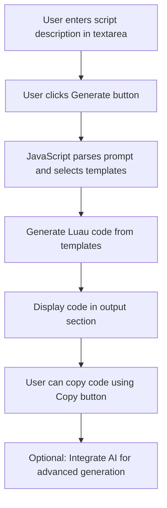

# Website Design Plan for Luau LocalPlayer Script Generator

## Overview
This website allows users to generate Luau code for Roblox LocalPlayer scripts by providing a description or prompt. The design focuses on simplicity, user-friendliness, and ease of code generation. It includes a placeholder for AI integration to enable advanced code generation in the future.

## File Structure
- `index.html`: Main HTML file containing the structure of the webpage, including the input form and output display.
- `styles.css`: CSS file for styling the interface, ensuring a clean and responsive design.
- `script.js`: JavaScript file handling user interactions, code generation logic, and output display.
- `README.md`: Updated project documentation.

## Key Components
- **Input Section**: A textarea for users to enter their script description (e.g., "Create a script to make the player fly").
- **Generate Button**: Triggers the code generation process.
- **Output Section**: Displays the generated Luau code in a formatted code block.
- **Copy Button**: Allows users to copy the generated code to clipboard.
- **Header**: Simple title and description of the tool.

## HTML Structure
```html
<!DOCTYPE html>
<html lang="en">
<head>
    <meta charset="UTF-8">
    <meta name="viewport" content="width=device-width, initial-scale=1.0">
    <title>Luau Script Generator</title>
    <link rel="stylesheet" href="styles.css">
</head>
<body>
    <header>
        <h1>Luau LocalPlayer Script Generator</h1>
        <p>Enter a description to generate Luau code for Roblox scripts.</p>
    </header>
    <main>
        <form id="script-form">
            <label for="prompt">Script Description:</label>
            <textarea id="prompt" placeholder="e.g., Make the player invincible"></textarea>
            <button type="submit">Generate Code</button>
        </form>
        <section id="output">
            <h2>Generated Code</h2>
            <pre><code id="code-output"></code></pre>
            <button id="copy-btn">Copy Code</button>
        </section>
    </main>
    <script src="script.js"></script>
</body>
</html>
```

## CSS Styling
- **Layout**: Use flexbox for centering and responsive design.
- **Colors**: Dark background (#1e1e1e) with light text for a code editor feel.
- **Typography**: Monospace font for code output.
- **Responsiveness**: Media queries for mobile devices.
- **Styling Details**:
  - Body: Full height, centered content.
  - Form: Padded inputs, styled button.
  - Output: Scrollable code block, hidden initially, shown after generation.

## JavaScript Functionality
- **Event Handling**: Listen for form submission to prevent default and trigger generation.
- **Code Generation**: A function that takes the prompt and generates code.
- **Output Display**: Update the code element with generated code and show the output section.
- **Copy Functionality**: Use navigator.clipboard to copy code to clipboard.
- **Error Handling**: Basic validation for empty prompts.

## Code Generation Logic
### Simple Template System
- Define a set of templates for common script types (e.g., fly, teleport, speed).
- Parse the prompt for keywords using simple string matching or regex.
- Combine matching templates into a complete script.
- Example:
  - If prompt contains "fly", include fly script snippet.
  - Wrap in LocalPlayer context.

### Placeholder for AI Integration
- Replace the template system with an API call to an AI service (e.g., OpenAI) for more dynamic generation.
- Function signature: `async function generateCode(prompt) { /* API call */ }`
- For now, implement with templates to demonstrate.

## Workflow Diagram


## Next Steps
- Implement the HTML, CSS, and JS as per this plan.
- Test the template system with various prompts.
- Add syntax highlighting (e.g., using Prism.js) for better code display.
- Ensure the site is hosted on GitHub Pages.